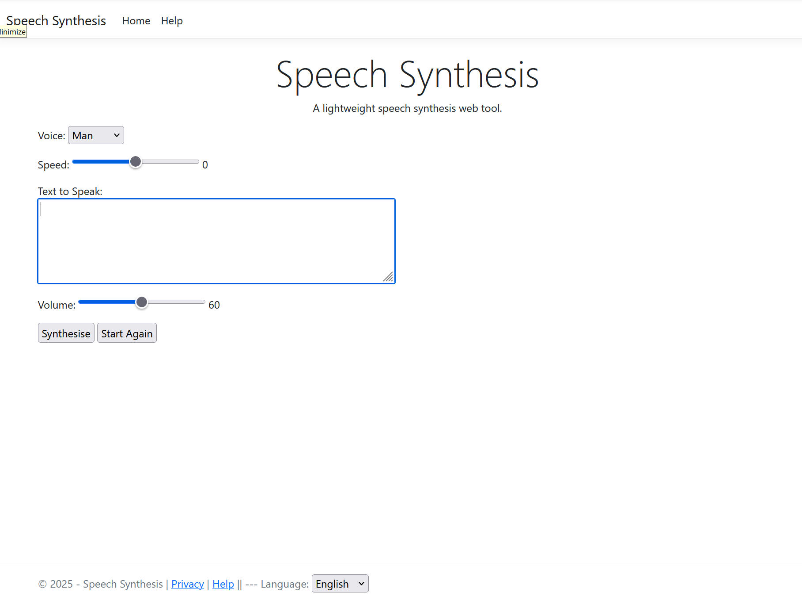

# Speech Synthesis
A lightweight speech synthesis web tool written in C#. 

## Features
- Adjust the voice default volume.
- Switch voices used.
- Change the voice rate of speed.
- Includes a REST based API.
- UI supports English, Spanish, French and German.

## Screenshots

## Source Code
View the project [Source Code](https://github.com/hayes0278/Speech-Synthesis).

## How It Works
- User enters text to synthesize, default is Test.
- Select the user interface language, default is English.
- Select the spoken voice desired, the default is Microsoft David Desktop.
- Take the input and generate the voice response.

## Helpful Links
- [Development URL](https://localhost:7021)
- [Swagger URL](https://localhost:7021/swagger)

## Limitations
- There is no input checking and sanitation performed either client or server side.
- 

## Retrospective
- 
- 